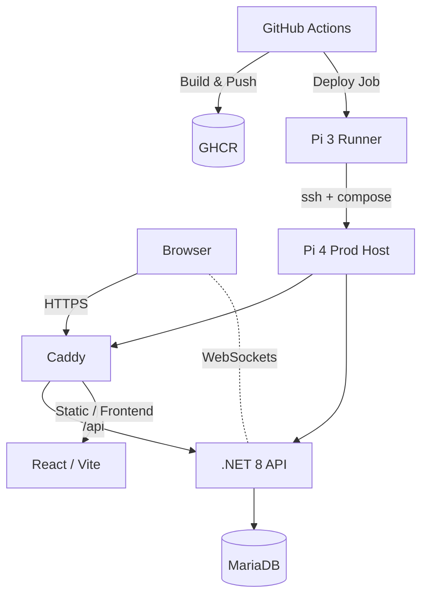

# SteenBudgetSolution

[](https://github.com/lsteen89/SteenBudgetSolution/actions/workflows/cicd.yml)


A full-stack personal finance app focused on **security**, **clean architecture**, and a **lean self-hosted** deployment. The backend is .NET 8 (C#), the frontend is React/Vite, and everything is shipped with Docker to a Raspberry Pi home-lab.

---

## Project status

> **WIP** – active development. Folder structure and features evolve as the system is refined toward a final stable cut.

---

## Highlights

- 🔐 **Authentication built right**  
  Short-lived JWT **access tokens** (in-memory) + opaque **refresh tokens** (HttpOnly cookie) with rotation & absolute cap.

- 📧 **Email workflows**  
  Verification, resend, and contact-us via SMTP (MailKit) with per-user/per-IP **rate limiting**.

- 🧱 **Vertical slices + MediatR**  
  Thin controllers, orchestration in handlers, repositories do SQL. Unit of Work wraps data operations.

- 🧰 **Self-hosted CI/CD**  
  GitHub Actions builds **multi-arch** images → Pi runner deploys via `docker compose` with readiness checks.

- 🛡️ **Defense in depth**  
  Lockouts, CAPTCHA, secure cookies, best-effort JWT blacklist, WebSocket session revocation.

---

## Architecture (high-level)

- **Frontend**: React (TypeScript), Vite, Tailwind. Served by **Caddy**.
- **Backend**: ASP.NET Core (.NET 8), MediatR, Dapper, MariaDB, WebSockets.
- **Infra**: Docker Compose (Pi 4 prod host), GHCR for images, Pi 3 runner for deploys, Cloudflare DNS for Caddy’s DNS-01.


## Repository layout (abridged)

    Backend/
    ├── Application/
    │   ├── Abstractions/…             # Interfaces (Data, Email, Security, etc.)
    │   ├── Common/…                   # Behaviors, cross-cutting
    │   ├── DTO/…                      # Transport objects
    │   ├── Features/
    │   │   ├── Authentication/…       # Login, Logout, Refresh, Verify, Resend
    │   │   ├── Contact/…              # Contact form
    │   │   ├── Register/…             # Registration flow
    │   │   └── Wizard/…               # Budget wizard
    │   ├── Helpers/Jwt/…
    │   ├── Mappings/…
    │   ├── Options/…                  # JwtSettings, Lockout, Email, Urls
    │   └── Validators/…
    ├── Domain/
    │   ├── Entities/…                 # Auth, Budget, Email, User, Wizard
    │   └── Shared/…
    ├── Infrastructure/
    │   ├── Data/Sql/…                 # BaseClass, Factories, Health
    │   ├── Repositories/…             # Auth, User, Budget, Email
    │   ├── Email/…                    # MailKit impl, rate limits repo
    │   ├── Auth/ Security/ WebSockets/…
    │   └── BackgroundServices/…
    ├── Presentation/
    │   ├── Controllers/               # Thin endpoints
    │   └── Middleware/
    ├── Settings/…
    ├── Program.cs
    └── docs/
        ├── authentication.md
        ├── rate-limits.md
        ├── email-workflows.md
        └── api.md
    
    Backend.Tests/
    ├── Authentication/…               # Integration/API tests
    ├── Slice/_Infra/…                 # Slice helpers
    ├── Unit/Features/Authentication/… # Unit tests (login/logout/refresh)
    └── Configuration/…

# Getting Started

## 1) Prerequisites

- **Docker & Docker Compose**
- **A domain** (for TLS) and **Cloudflare token** if you use Caddy DNS-01
- *(Optional)* **.NET 8 SDK** + **Node 20** for local development without Docker

---

## 2) Configure `.env` (root)

```dotenv
# Runtime
ASPNETCORE_ENVIRONMENT=Production

# Secrets
WEBSOCKET_SECRET=             # 32+ bytes random
JWT_SECRET_KEY=               # 32+ bytes (raw or base64:... format)
RECAPTCHA_SECRET_KEY=

# DB (app)
DATABASESETTINGS__CONNECTIONSTRING=Server=mariadb;Port=3306;Database=steenbudgetPROD;User Id=...;Password=...;SslMode=Preferred

# DB (container)
DB_ROOT_PASSWORD=...
DB_USER=steenbudget
DB_PASSWORD=...
MARIADB_DATABASE=steenbudgetPROD

# SMTP (prod)
SMTP_HOST=
SMTP_PORT=587
SMTP_USER=
SMTP_PASSWORD=
SMTP_PASSWORD_INFO=
SMTP_FROM=noreply@ebudget.se

# Caddy DNS-01
CLOUDFLARE_API_TOKEN=...

# URLs used in emails
AppUrls__VerifyUrl=https://yourdomain.tld/verify-email
```
>Tip: Keep .env out of git. Store a safe .env.example for reference.

## 3) Bring up the stack

        docker compose up -d
        docker compose ps
        docker compose logs backend --tail=100

### Health checks:

    Liveness: GET http://<backend>:8080/api/healthz

    Readiness: GET http://<backend>:8080/api/readyz

### Local Development (without Docker)

#### Backend:

    cd Backend
    dotnet dev-certs https --trust
    dotnet restore
    dotnet run

#### Frontend:

    cd Frontend
    npm ci
    npm run dev

### Configuration: JWT & Cookies

JWT secret must be ≥32 bytes (or prefixed with base64: for a base64 value).
Refresh token cookie is:

    HttpOnly

    Secure

    SameSite=Strict/Lax

    Sent by server, never readable by JS.

> Access token (JWT) is stored in memory on the client.
More details: docs/authentication.md

## CI/CD

### Build Job (GitHub Actions)

    Build & push backend image to GHCR (linux/amd64, linux/arm64).
    Build frontend artifact (Vite) and upload it.
    Build Caddy (arm64) only if caddy/** changed.

### Deploy Job (self-hosted runner on Pi 3)

    Downloads frontend artifact.

    SSH to Pi 4 host, docker compose pull && docker compose up -d.

    Verifies health: /api/healthz and /api/readyz.

    Shows last backend logs on failure.

>Workflow: .github/workflows/cicd.yml

## Testing

    Unit tests: handlers, policies

    Integration/API tests: auth flows, refresh rotation, logout, verification

    Tools: xUnit, FluentAssertions, Microsoft.AspNetCore.Mvc.Testing, Moq, Coverlet

Run locally:

    cd Backend.Tests
    
dotnet test

    CI runs tests on every push before build/publish.

# Security Notes

Access tokens live in memory; refresh token stays in cookie → reduces XSS blast radius.

Failed logins recorded → lockout policy enforced.

Best-effort JWT blacklist on logout + WebSocket session revoke.

Reverse proxy security headers: HSTS, CSP, X-Frame-Options, etc.


> **Tip:** Keep `.env` out of git. Provide a safe `\`.env.example\`` for reference.

To run tests locally:

    cd Backend.Tests
    dotnet test

CI automatically runs these tests on every push before building and publishing.

Documentation

    docs/authentication.md – token model & flows

    docs/rate-limits.md – email rate limiting

    docs/email-workflows.md – verification/resend/contact

    docs/api.md – endpoints & contracts

📄 License

This project is licensed under the MIT License. See the LICENSE file for details.
🤝 Contributing

Contributions are welcome! Feel free to fork the repository and open pull requests.

   
