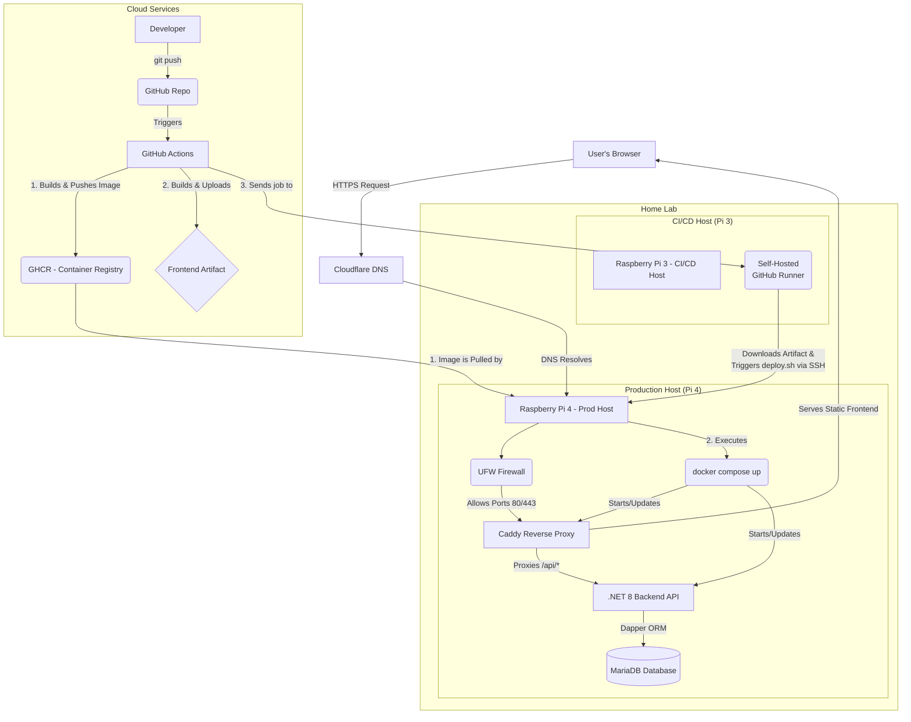

# SteenBudgetSolution

SteenBudgetSolution is a comprehensive, full-stack personal finance management application designed to empower users to track income, expenses, and manage budgets effectively.

This project showcases the ability to design, build, deploy, and manage a complete application end-to-end, with a strong emphasis on **secure development practices**, **modern technologies**, **robust infrastructure**, and **efficient CI/CD workflows**, all self-hosted on a Raspberry Pi home lab.

---

# Project Docs
   
   Quick links:
   
   - **Security**
     - [Authentication](Security/Authentication.md)
     - [Rate Limits](Security/rate-limits.md)
   - **Email**
     - [Email Workflows](Email/email-workflows.md)
   - **API**
     - [API Reference](API/api.md)
   - **WebSockets**
     - [WebSocket Handler](WebSockets/WebSocketHandler.md)
   - **Roadmap**
     - [Roadmap](roadmap.md)
 
---

# Architecture Overview

This project uses a modern, separated architecture to ensure security, stability, and maintainability.

### Pi 4 (Production Host)
* **Role:** The dedicated, hardened server that runs the live application stack.
* **Services:** Runs the entire stack within Docker Compose: MariaDB, the .NET 8 backend API, and a Caddy web server.
* **Security:**
    * Exposes only HTTP/HTTPS (80/443) to the web.
    * SSH (port 2222) is only accessible from the Pi 3 runner's local IP address. All other SSH traffic is blocked by `ufw`.
    * SSH is configured for key-only authentication; password login is disabled.
* **Secrets:** All application secrets (database credentials, JWT keys, etc.) are managed in a `.env` file in the project directory, which is excluded from Git.

### Pi 3 (CI/CD Runner & Deploy Orchestrator)
* **Role:** A trusted, internal orchestrator that receives deployment jobs from GitHub and executes them securely.
* **Services:** Runs a single containerized GitHub Actions self-hosted runner.
* **Security:**
    * Requires **zero inbound ports** from the internet. It only makes outbound connections to GitHub.
    * It communicates with the Pi 4 over the local LAN using a dedicated, forced-command SSH key.
    * Its sole purpose is to execute the deployment steps defined in the CI/CD workflow.

### GitHub (Cloud Build Environment)
* **Role:** Acts as a powerful, disposable **build factory**. It handles all CPU-intensive compilation and packaging.
* **Actions:**
    * On a push to `master`, it builds a **multi-architecture (`linux/amd64`, `linux/arm64`)** backend Docker image and pushes it to the GitHub Container Registry (GHCR).
    * It builds the production-optimized React frontend (`dist` bundle) and uploads it as a workflow artifact.
    * It then triggers the `deploy` job, which is picked up by the self-hosted runner on the Pi 3.

### Cloudflare (DNS & TLS Helper)
* **Role:** Manages the `ebudget.se` DNS records.
* **Actions:** Used by Caddy to perform the ACME DNS-01 challenge. Caddy uses a scoped API token to create and delete temporary TXT records to prove domain ownership for issuing and renewing Let's Encrypt TLS certificates.

---

## Key Features

* 🔐 **Secure User Authentication:** Robust JWT-based authentication featuring auto-refresh, periodic status checks, and WebSocket integration for immediate session termination.
* 🤖 **ReCAPTCHA Integration:** Protects user registration from bots using Google reCAPTCHA v3.
* 💰 **Full CRUD Operations:** Manage budgets, income, and expense transactions with complete Create, Read, Update, and Delete functionality.
* 📧 **Email Notifications:** Integrated SMTP client (using MailKit) for user email verification and essential notifications.
* 📱 **Responsive Design:** Modern, mobile-first UI built with Tailwind CSS ensures a great experience on any device.
* 🚀 **Real-time Communication:** Employs WebSockets for immediate server-driven events (like session termination) and uses a ping/pong mechanism to maintain connection health.
* 🛡️ **Hardened Security:** Multi-layered security approach including infrastructure hardening and application-level protections.

---

## Tech Stack

**Backend:**

* **Framework:** .NET 8 (C#) with ASP.NET Core Web API
* **Database:** MariaDB (SQL-based relational database)
* **Data Access:** Dapper (Micro-ORM, chosen for performance and direct SQL control)
* **Architecture:** Clean Architecture principles for separation of concerns and testability.
* **Real-time:** ASP.NET Core WebSockets
* **Email:** MailKit

**Frontend:**

* **Framework:** React (TypeScript) for a robust and type-safe UI.
* **Build Tool:** Vite for fast development server and optimized builds.
* **Styling:** Tailwind CSS (Utility-first CSS framework).
* **API Communication:** Axios (with interceptor for token refresh)

**Infrastructure & DevOps:**

* **Host:** Self-hosted on Raspberry Pi 4 (Linux OS)
* **Orchestrator:** Raspberry Pi 3 (Linux OS)
* **Containerization:** Docker & Docker Compose
* **Web Server / Reverse Proxy:** Caddy (with automatic HTTPS)
* **Security Tools:** UFW (Firewall), Fail2Ban (Intrusion Prevention)
* **CI/CD:** GitHub Actions (Automated build, test, and deployment pipeline)
* **Secrets Management:** GitHub Actions Secrets & `.env` file on host.
* **Domain & Network:** Custom Domain, DNS Management via Cloudflare

---

## 🚀 Getting Started (Local Development)

Follow these instructions to get the project running on your local machine for development and testing purposes.

### 1. Clone repo, create .env file.
### 2. Run the full stack with a single command:
      docker compose -f docker-compose.dev.yml up
> assuming you have a docker-compose.dev.yml file for local dev)
 Your backend and frontend will be running in containers,
 and you can use docker compose exec to run commands inside them.

---
## High-Level System Flowchart

## License

[MIT License](LICENSE)
