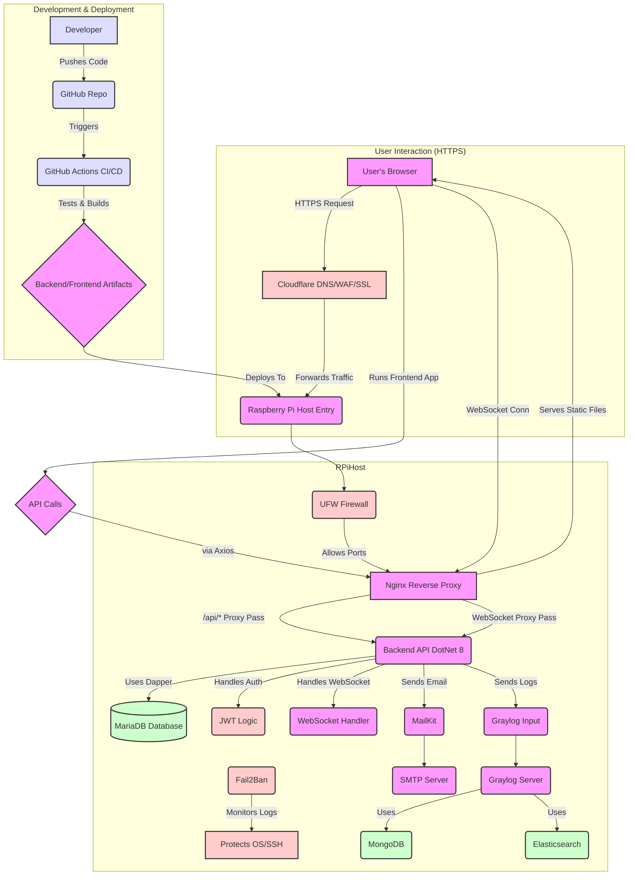

# SteenBudgetSolution

 

SteenBudgetSolution is a comprehensive, full-stack personal finance management application designed to empower users to track income, expenses, and manage budgets effectively.

This project showcases the ability to design, build, deploy, and manage a complete application end-to-end, with a strong emphasis on **secure development practices**, **modern technologies**, **robust infrastructure**, and **efficient CI/CD workflows**, all self-hosted on a Raspberry Pi.

## Key Features

*   🔐 **Secure User Authentication:** Robust JWT-based authentication featuring auto-refresh, periodic status checks, and WebSocket integration for immediate session termination. See the detailed **[Authentication Flow Guide](docs/Security/Authentication.md)**.
*   🤖 **ReCAPTCHA Integration:** Protects user registration from bots using Google reCAPTCHA v3.
*   💰 **Full CRUD Operations:** Manage budgets, income, and expense transactions with complete Create, Read, Update, and Delete functionality.
*   📧 **Email Notifications:** Integrated SMTP client (using MailKit) for user email verification and essential notifications.
*   📱 **Responsive Design:** Modern, mobile-first UI built with Tailwind CSS ensures a great experience on any device.
*   🚀 **Real-time Communication:** Employs WebSockets for immediate server-driven events (like session termination) and uses a ping/pong mechanism to maintain connection health. More details in the **[WebSocket Implementation Guide](docs/WebSocket/WebSocketHandler.md)**.
*   🛡️ **Hardened Security:** Multi-layered security approach including infrastructure hardening and application-level protections.
*   📊 **Centralized Logging:** Robust logging infrastructure using Graylog for enhanced monitoring and troubleshooting.

## Tech Stack

**Backend:**

*   **Framework:** .NET 8 (C#) with ASP.NET Core Web API
*   **Database:** MariaDB (SQL-based relational database)
*   **Data Access:** Dapper (Micro-ORM, chosen for performance and direct SQL control)
*   **Architecture:** Clean Architecture principles for separation of concerns and testability.
*   **Real-time:** ASP.NET Core WebSockets ([custom implementation](docs/WebSocket/WebSocketHandler.md))
*   **Email:** MailKit

**Frontend:**

*   **Framework:** React (TypeScript) for a robust and type-safe UI.
*   **Build Tool:** Vite for fast development server and optimized builds.
*   **Styling:** Tailwind CSS (Utility-first CSS framework).
*   **API Communication:** Axios (with interceptor for token refresh - see [Authentication Flow](docs/Security/Authentication.md))

**Infrastructure & DevOps:**

*   **Host:** Self-hosted on Raspberry Pi (Linux OS)
*   **Web Server:** Nginx
*   **Database Server:** MariaDB Server
*   **Containerization:** Docker (used for Graylog dependencies: MongoDB & Elasticsearch)
*   **Logging:** Graylog (Centralized log management)
*   **Security Tools:** UFW (Firewall), Fail2Ban (Intrusion Prevention), Secure SSH (Key-based authentication)
*   **CI/CD:** GitHub Actions (Automated build, test, and deployment pipeline)
*   **Secrets Management:** GitHub Actions Secrets & Environment Variables on host.
*   **Domain & Network:** Custom Domain, DNS Management, Cloudflare, SSL Certificates (via Let's Encrypt)

## Core Concepts & Highlights

### 🛡️ Security First

Security is a core consideration throughout the stack:

*   **Authentication:** Robust multi-layered JWT implementation described in the **[Authentication Flow Guide](docs/Security/Authentication.md)**.
*   **Infrastructure:** Hardened server environment using UFW, Fail2Ban, and key-based SSH. Network protected by the UFW firewall and Cloudflare.
*   **Data Protection:** Secure handling of credentials using environment variables and GitHub Secrets. ReCAPTCHA prevents automated abuse.
*   **Email Security:** Recommended setup includes SPF and DKIM records for email authentication (details in `INSTALL.md`).
*   **Dependencies:** Regular monitoring/updating of dependencies.

### 🚀 DevOps & Self-Hosted Infrastructure

This project demonstrates practical DevOps skills managing a complete deployment environment on a Raspberry Pi:

*   **Full Setup:** Configuration of the Linux OS, Nginx web server, MariaDB database server, DNS records, and SSL certificates. For specific RPi configuration details, see the **[InstallMD](INSTALL.md)** 
*   **CI/CD Automation:** GitHub Actions pipeline handles testing, building, and deploying the application automatically on pushes to the main branch.
*   **Container Management:** Docker utilized effectively to manage dependencies for Graylog.

### 📊 Centralized Logging with Graylog

*   Graylog provides powerful, centralized logging capabilities, aggregating logs from the .NET application and potentially the server itself.
*   Facilitates monitoring application health, diagnosing issues quickly, and analyzing usage patterns.
*   Requires Dockerized MongoDB and Elasticsearch (Setup detailed in `INSTALL.md`).

## Getting Started

For detailed instructions on setting up the development environment, configuring the infrastructure (including database, Graylog, security tools), and running the application, please refer to the comprehensive **main installation guide**:

➡️ **[`INSTALL.md`](INSTALL.md)** ⬅️

## Why This Project?

This project serves as a practical demonstration of my ability to architect, develop, deploy, and manage a sophisticated full-stack application independently. It highlights proficiency in modern C#/.NET and React development, coupled with strong, hands-on experience in DevOps, infrastructure management, and security best practices within a real-world (self-hosted) environment.

## High level flowchart

## License

This project is licensed under the **GNU Affero General Public License v3 (AGPLv3)**.

A copy of the full license text can be found in the [LICENSE](LICENSE) file.

### Summary of AGPLv3

In simple terms, the AGPLv3 license means:

*   **Freedom to Use:** You are free to run the software for any purpose.
*   **Freedom to Study & Modify:** You can view the source code, study how it works, and change it to suit your needs.
*   **Freedom to Share:** You can share copies of the original software.
*   **Freedom to Share Modifications (Copyleft):** If you modify the software and distribute those modifications, you **must** also license your modifications under AGPLv3 and provide the source code.
*   **Network Service Clause:** Crucially, if you modify the software and make its functionality available to users over a network (like a web service), you **must** provide the source code of your modified version to those users under the AGPLv3 license. This ensures that services built on this code remain open.

This license is chosen to ensure the software remains free and open for everyone to use, modify, and share, while preventing it from being used to create closed-source, proprietary services that don't give back to the community.
