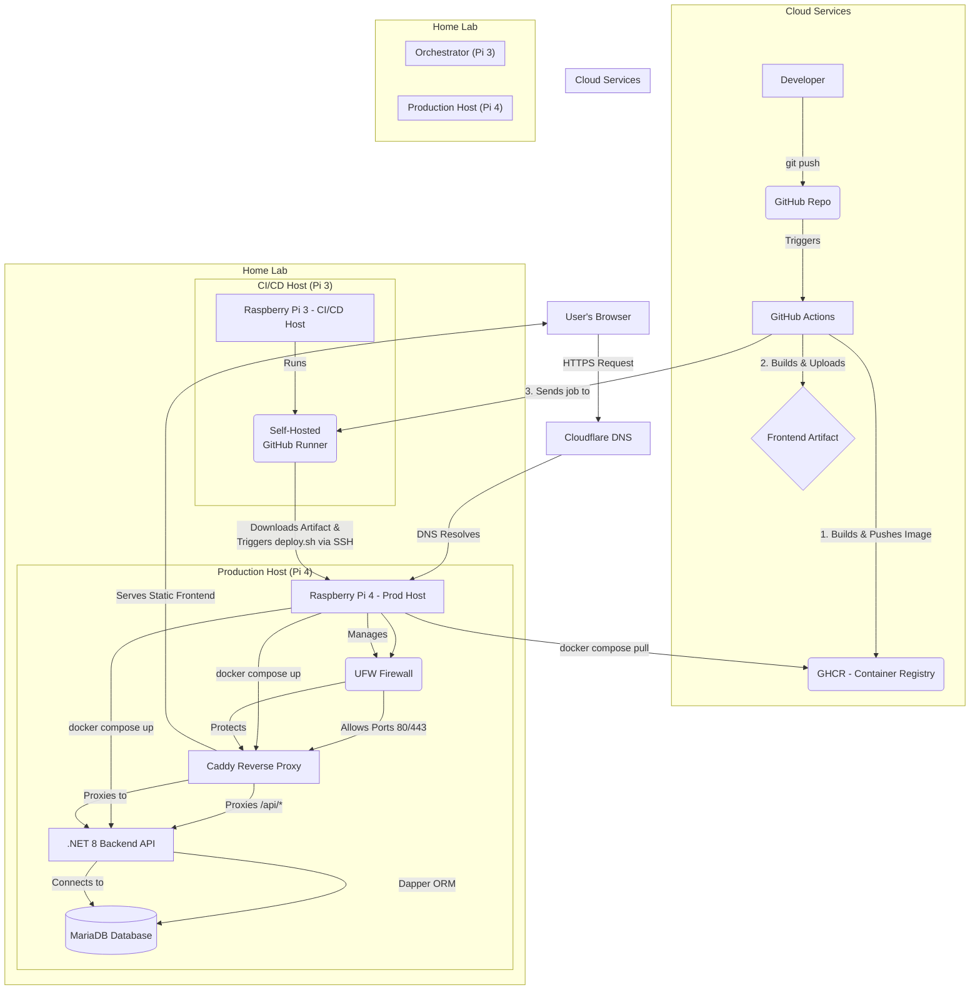

# SteenBudgetSolution

[](https://github.com/lsteen89/SteenBudgetSolution/actions/workflows/cicd.yml)


SteenBudgetSolution is a comprehensive, full-stack personal finance management application designed to empower users to track income, expenses, and manage budgets effectively.

This project showcases the ability to design, build, deploy, and manage a complete application end-to-end, with a strong emphasis on **secure development practices**, **modern technologies**, **robust infrastructure**, and **efficient CI/CD workflows**, all self-hosted on a Raspberry Pi home lab.

---

## Architecture Overview

This project uses a modern, separated architecture to ensure security, stability, and maintainability.

### Pi 4 (Production Host)
* **Role:** The dedicated, hardened server that runs the live application stack.
* **Services:** Runs the entire stack within Docker Compose: MariaDB, the .NET 8 backend API, and a Caddy web server.
* **Security:**
    * Exposes only HTTP/HTTPS (80/443) to the web.
    * SSH (port 2222) is only accessible from the Pi 3 runner's local IP address. All other SSH traffic is blocked by `ufw`.
    * SSH is configured for key-only authentication; password login is disabled.
* **Secrets:** All application secrets (database credentials, JWT keys, etc.) are managed in a `.env` file in the project directory, which is excluded from Git.

### Pi 3 (CI/CD Runner & Deploy Orchestrator)
* **Role:** A trusted, internal orchestrator that receives deployment jobs from GitHub and executes them securely.
* **Services:** Runs a single containerized GitHub Actions self-hosted runner.
* **Security:**
    * Requires **zero inbound ports** from the internet. It only makes outbound connections to GitHub.
    * It communicates with the Pi 4 over the local LAN using a dedicated, forced-command SSH key.
    * Its sole purpose is to execute the deployment steps defined in the CI/CD workflow.

### GitHub (Cloud Build Environment)
* **Role:** Acts as a powerful, disposable **build factory**. It handles all CPU-intensive compilation and packaging.
* **Actions:**
    * On a push to `main`, it builds a **multi-architecture (`linux/amd64`, `linux/arm64`)** backend Docker image and pushes it to the GitHub Container Registry (GHCR).
    * It builds the production-optimized React frontend (`dist` bundle) and uploads it as a workflow artifact.
    * It then triggers the `deploy` job, which is picked up by the self-hosted runner on the Pi 3.

### Cloudflare (DNS & TLS Helper)
* **Role:** Manages the `ebudget.se` DNS records.
* **Actions:** Used by Caddy to perform the ACME DNS-01 challenge. Caddy uses a scoped API token to create and delete temporary TXT records to prove domain ownership for issuing and renewing Let's Encrypt TLS certificates.

---

## Key Features

* 🔐 **Secure User Authentication:** Robust JWT-based authentication featuring auto-refresh, periodic status checks, and WebSocket integration for immediate session termination.
* 🤖 **ReCAPTCHA Integration:** Protects user registration from bots using Google reCAPTCHA v3.
* 💰 **Full CRUD Operations:** Manage budgets, income, and expense transactions with complete Create, Read, Update, and Delete functionality.
* 📧 **Email Notifications:** Integrated SMTP client (using MailKit) for user email verification and essential notifications.
* 📱 **Responsive Design:** Modern, mobile-first UI built with Tailwind CSS ensures a great experience on any device.
* 🚀 **Real-time Communication:** Employs WebSockets for immediate server-driven events (like session termination) and uses a ping/pong mechanism to maintain connection health.
* 🛡️ **Hardened Security:** Multi-layered security approach including infrastructure hardening and application-level protections.

---

## Tech Stack

**Backend:**

* **Framework:** .NET 8 (C#) with ASP.NET Core Web API
* **Database:** MariaDB (SQL-based relational database)
* **Data Access:** Dapper (Micro-ORM, chosen for performance and direct SQL control)
* **Architecture:** Clean Architecture principles for separation of concerns and testability.
* **Real-time:** ASP.NET Core WebSockets
* **Email:** MailKit

**Frontend:**

* **Framework:** React (TypeScript) for a robust and type-safe UI.
* **Build Tool:** Vite for fast development server and optimized builds.
* **Styling:** Tailwind CSS (Utility-first CSS framework).
* **API Communication:** Axios (with interceptor for token refresh)

**Infrastructure & DevOps:**

* **Host:** Self-hosted on Raspberry Pi 4 (Linux OS)
* **Orchestrator:** Raspberry Pi 3 (Linux OS)
* **Containerization:** Docker & Docker Compose
* **Web Server / Reverse Proxy:** Caddy (with automatic HTTPS)
* **Security Tools:** UFW (Firewall), Fail2Ban (Intrusion Prevention)
* **CI/CD:** GitHub Actions (Automated build, test, and deployment pipeline)
* **Secrets Management:** GitHub Actions Secrets & `.env` file on host.
* **Domain & Network:** Custom Domain, DNS Management via Cloudflare

---

## 🚀 Getting Started (Local Development)

Follow these instructions to get the project running on your local machine for development and testing purposes.

### Prerequisites

* [.NET 8 SDK](https://dotnet.microsoft.com/download/dotnet/8.0)
* [Node.js](https://nodejs.org/) (v18 or later)
* [Docker](https://www.docker.com/products/docker-desktop/)
* [Git](https://git-scm.com/)

### Installation

1.  **Clone the repository:**
    ```sh
    git clone [https://github.com/lsteen89/SteenBudgetSolution.git](https://github.com/lsteen89/SteenBudgetSolution.git)
    cd SteenBudgetSolution
    ```

2.  **Set up Backend Environment Variables:**
    * Navigate to the backend project directory.
    * Create a `.env` file by copying the example: `cp env.example .env`
    * Fill in the required values in your new `.env` file (database credentials, JWT secret, etc.).

3.  **Start the Database:**
    * Run the MariaDB container using Docker Compose. This will also create the necessary volume for data persistence.
    ```sh
    docker-compose up -d db
    ```

4.  **Run the Backend API:**
    * Navigate to the backend project directory.
    * Trust the dev certificate, restore dependencies, and run the application.
    ```sh
    dotnet dev-certs https --trust
    dotnet restore
    dotnet run
    ```
    The API will be available at `https://localhost:5001`.

5.  **Run the Frontend:**
    * Open a new terminal and navigate to the `frontend` directory.
    * Install dependencies and start the development server.
    ```sh
    npm install
    npm run dev
    ```
    The frontend will be available at `http://localhost:3000` and will proxy API requests to the backend.


## High-Level System Flowchart



## License

[MIT License](LICENSE)
