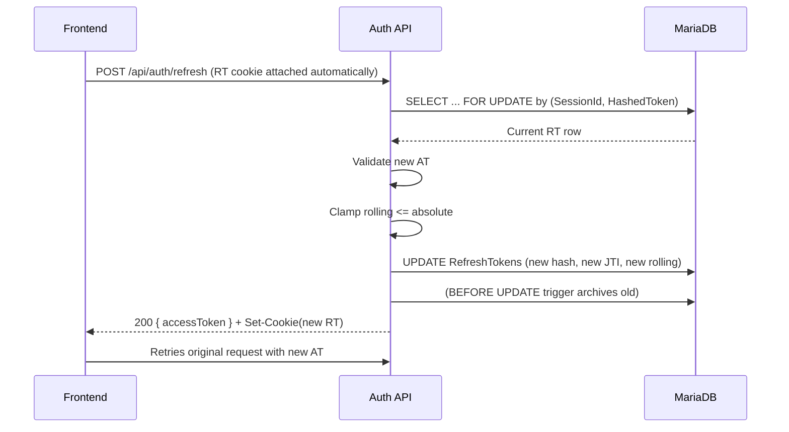

## TL;DR

* **AT (access token)**: short-lived JWT, kept **in memory** on the client.
* **RT (refresh token)**: opaque string in **HttpOnly+Secure cookie**; never exposed to JS.
* **Refresh**: validates & **rotates RT in-place** (single-use), issues a new AT + sets a new RT cookie.
* **Expiry policy**: **rolling window** (extended on refresh) with **absolute cap** (e.g. 90 days).
* **Logout**: revoke RT(s) in DB, best-effort blacklist AT, notify active WS session(s).

---

## Tokens & Storage

### Access Token (AT)

* JWT, TTL: `Jwt.ExpiryMinutes` (e.g. 15m).
* Claims include: `sub` (persoId), `sessionId`, roles, `jti`, etc.
* Stored **only in memory** (never localStorage/sessionStorage).
* Sent as `Authorization: Bearer <AT>`.

### Refresh Token (RT)

* Opaque random string (not a JWT).
* Stored **only** via `Set-Cookie`:

  ```
  HttpOnly; Secure; SameSite=Strict|Lax; Path=/; Expires=<rolling-exp>
  ```
* DB table `RefreshTokens` (Dapper/MariaDB):

  * `TokenId (GUID)`, `PersoId (GUID)`, `SessionId (GUID)`
  * `HashedToken`, `AccessTokenJti`, `ExpiresRollingUtc`, `ExpiresAbsoluteUtc`
  * `Status`, `DeviceId`, `UserAgent`, `CreatedUtc`, `RevokedUtc`
* **Rotation**: On each successful refresh we **hash the new RT**, update `AccessTokenJti`, and **extend rolling exp**:

  ```txt
  newRolling = min(now + rollingWindowDays, current.ExpiresAbsoluteUtc)
  ```
* **Absolute cap**: `Jwt.RefreshTokenExpiryDaysAbsolute` (e.g. 90). Beyond this, refresh stops → full login required.

## Refresh flow



---

## Endpoints (shapes & statuses)

### POST `/api/auth/login`

**Body**: `{ email, password, captchaToken, rememberMe, deviceId, userAgent }`
**200 OK** → `ApiResponse<AuthResult>`; RT is set via `Set-Cookie`.
**401/400** → `ApiErrorResponse { errorCode, message }`.

### POST `/api/auth/refresh`

* **Auth**: `RefreshScheme` (expired AT allowed) + RT cookie.
* **200 OK** → `ApiResponse<AuthResult>` + new RT cookie (rotated).
* **401** (missing/invalid) / **400** (validation) → `ApiErrorResponse`.

### POST `/api/auth/logout?logoutAll=bool`

* **Auth**: `RefreshScheme` + RT cookie.
* **204 No Content**; RTs revoked, AT best-effort blacklisted; RT cookie cleared.

> Envelope:
>
> * Success → `ApiResponse<T> { data: T }`
> * Error → `ApiErrorResponse { errorCode, message }`

---

## JSON contract & naming

* Server uses `System.Text.Json` camelCase.
  C# `PersoId` → JSON `persoId`.
* **FE standard**: always camelCase: `persoId`, `sessionId`, `wsMac`.

---

## Client notes (React)

* Axios interceptor **unwraps** `ApiResponse<T>` → callers see `T` directly.
* On `401` (non-auth routes), do **one** `refresh` attempt → replay the request; else `logout`.
* AT is kept in memory; RT never touched (cookie-managed by browser).
* WS connection uses `sid`, `uid` (or `persoId`), `mac`:

  ```
  ws[s]://<host>/ws/auth?sid=<sessionId>&uid=<persoId>&mac=<wsMac>
  ```

  Server validates `mac = HMAC(persoId|sessionId, WEBSOCKET_SECRET)`; optional AT re-auth in-band.

---

## JWT signing & validation (HS256 + rotation)

* **Key ring** at `Jwt.Keys` with an **ActiveKid**:

  ```json
  // appsettings.Production.json
  "Jwt": {
    "Issuer": "eBudget",
    "Audience": "eBudget",
    "ExpiryMinutes": 15,
    "ActiveKid": "2025-09-11",
    "Keys": {
      "2025-09-11": "__ENV__:JWT_KEYS__2025_09_11",
      "2025-12-01": "__ENV__:JWT_KEYS__2025_12_01"
    },
    "RefreshTokenExpiryDays": 30,
    "RefreshTokenExpiryDaysAbsolute": 90
  }
  ```
* Keys are **base64 random ≥32 bytes**; stored via env/secret files.
* New tokens are signed with `ActiveKid`; validators accept **all keys** present in `Jwt.Keys`.
* **Rotation**: add new key → deploy → flip `ActiveKid` → after `AT_TTL + buffer` remove old key.

### Program.cs (auth wiring – DI-safe)

* Configure `JwtBearerOptions` via `AddOptions().Configure<IJwtKeyRing, JwtSettings>(...)`.
* **Do not** inject scoped services into options. Resolve them **per request** in events:

  ```csharp
  o.Events = new JwtBearerEvents {
    OnTokenValidated = async ctx => {
      var blacklist = ctx.HttpContext.RequestServices.GetRequiredService<ITokenBlacklistService>();
      var jti = ctx.Principal?.FindFirst(JwtRegisteredClaimNames.Jti)?.Value;
      if (jti != null && await blacklist.IsTokenBlacklistedAsync(jti)) ctx.Fail("revoked");
    }
  };
  ```

### JwtService (sign & validate)

* **Sign** with `_ring.ActiveKey` (HS256); header gets `kid = ActiveKid`.
* **Validate** using a `TokenValidationParameters` built from `_ring.All`; optionally allow expired for refresh.

---

## Security checklist

* AT in memory; RT in HttpOnly+Secure cookie; SameSite `Strict` (or `Lax` if cross-site refresh needed).
* CORS: allow FE origins; `AllowCredentials()` enabled when cookie is used.
* HTTPS everywhere (RT cookie requires Secure).
* Rate-limit login & email endpoints.
* Clock sync (NTP) to avoid JWT skew.
* Best-effort AT blacklist (JTI) on logout; hard-fail on RT revocation.

---

## DB objects (auth)

* `RefreshTokens` (+ `RefreshTokens_Archive` via `BEFORE UPDATE` trigger)
* `BlacklistedTokens` (optional AT JTI store)
* `VerificationToken` (email verification)

---

## Test matrix (smoke)

* Login → 200; Set-Cookie for RT; AT present.
* `/api/users/me` with AT → 200.
* Expire AT, call any API → 401 → auto-refresh → replay → 200.
* Logout → 204; RT cookie cleared; re-call API → 401.
* WS connect with valid `sid/uid/mac` → server “ready”; reply to pings.

---
