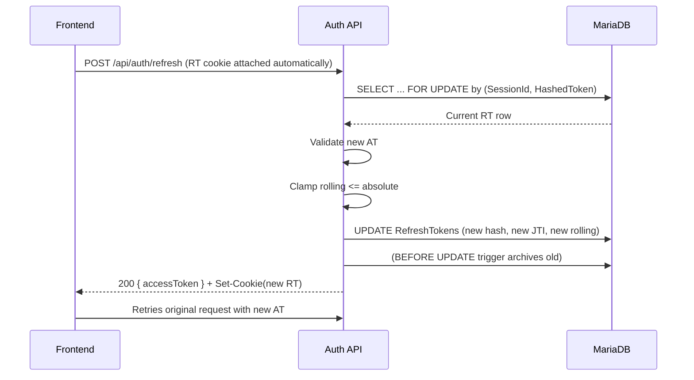

## TL;DR

- **AT** (access token) = short-lived JWT, stored **in memory** on the client.
- **RT** (refresh token) = opaque, **HttpOnly Secure cookie**, never exposed to JS.
- **Refresh** = validates + **rotates RT in-place** (single-use), sets a **new cookie**, returns a new AT.
- **Expiry policy** = **rolling** window (extended on refresh) with a hard **absolute cap** (e.g., 90 days).
- **Logout** = revoke RT(s) in DB, best-effort blacklist AT, WS notify.

---

## Tokens & storage

- **Access token (AT)**

  - JWT, short TTL (`JwtSettings:ExpiryMinutes`, e.g., 15m).
  - Issued with `SessionId`, `DeviceId`, roles, etc.
  - Stored **in memory** (never localStorage/sessionStorage).

- **Refresh token (RT)**

  - Opaque string (random), **not a JWT**.
  - Stored **only** in a `Set-Cookie` with:
    ```
    HttpOnly; Secure; SameSite=Strict|Lax; Path=/; Expires=<rolling>
    ```
  - DB row: `RefreshTokens` with `HashedToken`, `Persoid`, `SessionId`, `AccessTokenJti`, `ExpiresRollingUtc`, `ExpiresAbsoluteUtc`, `Status`, `DeviceId`, `UserAgent`, `CreatedUtc`.
  - **Rotation:** Each successful refresh **updates** `HashedToken`, `AccessTokenJti`, and **extends rolling expiry**; the **absolute expiry never increases**.

- **Absolute cap**

  - `JwtSettings:RefreshTokenExpiryDaysAbsolute` (e.g., 90). After this, refreshes stop → user must log in again.

---

## Login flow

1. Client `POST /api/auth/login` with `email`, `password`, `captchaToken`, `deviceId`, `userAgent`.
2. Server validates credentials, lockout, CAPTCHA.
3. Server issues **AT** and **RT** (new `SessionId`).
4. **RT** returned via `Set-Cookie` (HttpOnly, Secure, SameSite, Path, Expires).
5. **AT + user** returned in JSON. Client stores AT **in memory** only.

### Cookie example

```
Set-Cookie: RefreshToken=<opaque>; HttpOnly; Secure; SameSite=Strict; Path=/; Expires=Wed, 12 Nov 2025 10:00:00 GMT
```

---

## Refresh flow



**Clamp logic (server side):**

```
newRolling = min(now + rollingWindow, current.ExpiresAbsoluteUtc)
```

---

## Logout

- **Single session**: `POST /api/auth/logout` with `accessToken`, `sessionId` →

  - best-effort blacklist AT
  - `UPDATE RefreshTokens SET Status=Revoked, RevokedUtc=now` for (PersoId, SessionId)
  - clear cookie (`Set-Cookie: RefreshToken=; Expires=Thu, 01 Jan 1970 00:00:00 GMT`)
  - WS notify that session.

- **Logout all**: same endpoint with `logoutAll=true` → revoke all active RTs for the user; WS notify all sessions.

---

## Security notes

- **XSS:** in-memory AT reduces exposure.
- **CSRF:** Refresh uses SameSite cookie (Strict/Lax). For state-changing endpoints, apply CSRF defenses per deployment.
- **Lockout:** repeated invalid logins tracked + lock enforced.
- **Archiving:** `BEFORE UPDATE` trigger copies old RT row into `RefreshTokens_Archive` (audit).
- **JWT secret rotation:** see operations runbook; expect forced logout of all sessions.

---

## DB summary (auth tables)

- `RefreshTokens` (+ `RefreshTokens_Archive`)
- `BlacklistedTokens` (optional, AT best-effort blacklist)
- `VerificationToken` (email verification; `UNIQUE(PersoId)`, `UNIQUE(Token)`)

---
